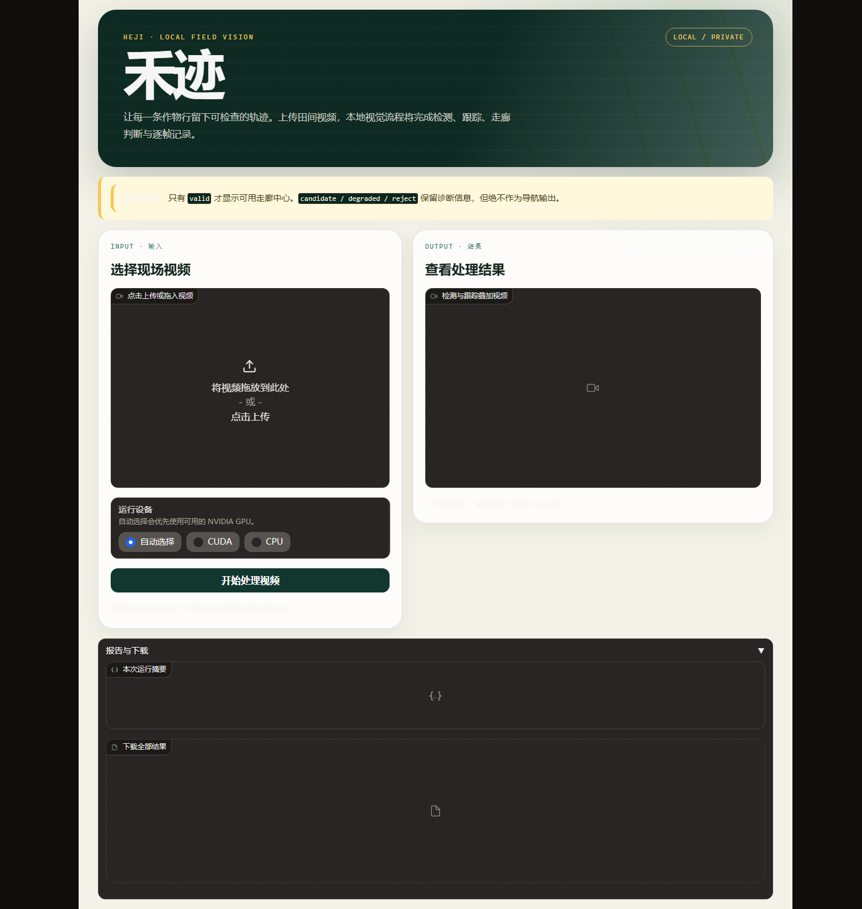

# Day69 第二版：可运行离线作物行 Pilot 与有效外部检验

日期：2026-09-10

## 1. 今天到底交付了什么

Day69 交付冻结离线推理程序，并在最终交付时增加本地可视化网页“禾迹”。用户可以双击启动、
在浏览器上传单段视频并直接预览/下载结果；命令行入口继续支持单视频或整个目录。两种入口都复用
同一个 Day63 感知模型、Day65 时序跟踪、Day66 导航输出合同和 Day68 遮挡恢复守卫，并产生：

- 每段视频一个带叠加信息的 MP4；
- 每帧一条 JSONL；
- 便于 Excel 查看的一份 CSV；
- 每段视频报告与整个任务的 `pilot_report.json`。

画面包含所有当前跟踪作物行、稳定 ID、置信度和四态；只有 `valid` 才显示左右边界、绿色
走廊中心线、方向代理和可用导航字段。`candidate/degraded/reject` 可以保留跟踪诊断，但导航
字段必须为 `null`。这次 896 个冻结视频帧中契约违规为 0。

## 第二版为什么必须做

第一版的软件交付通过，但 RowDetr 外部评价要求每条标注同时覆盖 `y=0.40` 与 `y=0.90`；实际
3,929 条折线没有一条覆盖远端锚点，导致参考分母为 0。因此第一版的外部部分只能裁决为
`INVALID/BLOCKED`，不能称为令人满意的完整 Day69。

第二版保留第一版全部记录，不改 Day61～68 模型、预处理、阈值或导航合同，只修正评价工程：

- 在折线真实可见的纵向交集上计算位置和方向，不外推不存在的标签；
- 用单调动态规划先最大化匹配数，再最小化误差；
- 参考分母为 0 时强制输出 `INVALID_REFERENCE_SUPPORT` 和 `null`，不再显示假 0 分；
- 已访问的 RowDetr 只作协议开发。`min_overlap=0.20` 时，1,707/1,760 张图、3,322 条折线可评价，
  证明第一版是合同失配，不是测得模型准确率为 0；
- 新外部确认必须来自未触碰数据，且冻结后无论成败都不得调参。

## 新外部来源筛选

CRIS-Cotton 虽为 CC BY 4.0 且保留视频帧文件名，但 115 个来源组中 106 个跨官方划分；冻结
19 个候选组后，只查看非保留开发行就确认其标签是目标检测框，而非多行中心线或走廊真值，故
裁决为 `REJECT_LABEL_TASK_MISMATCH`，没有用框中心伪造导航标签。

最终选择 SeedlingStemRow（SSR）v7 的 `expansion_2`：2026 年 1 月在广西扶绥采集的 98 张
逆光/阴影现场图像，每张有中央作物行 YOLO 分割多边形。基础集一图一标只用于格式/视角开发，
完整 `expansion_2` 在读取前冻结。协议哈希为
`8d98fd3b...0090234`，98 对文件全部校验 SHA-256，清单哈希为
`4f71f395...05eee`，记录哈希为 `cb37c83b...ad016`。

SSR 只标一条中央作物行，因此支持中央行召回、匹配位置和方向；它不支持“所有行 Precision”、
左右走廊边界、拒识或真实安全指标。检测到的其他真实行不能被误算为假阳性。

## 第二版冻结结果

| SSR expansion_2 指标 | 结果 | 冻结门槛 | 裁决 |
|---|---:|---:|---|
| 可评价参考 | 98/98 | 必须非零 | 通过 |
| 中央行匹配 | 70/98 | — | — |
| 中央行 Recall | 0.7143 | ≥0.80 | **失败** |
| 匹配可见位置 MAE | 0.0234 | ≤0.05 | 通过 |
| 匹配方向 MAE | 4.374° | ≤5° | 通过 |

这是有效的独立来源、后续现场时段正样本结果，不再是第一版那种无参考分母的 INVALID；但召回门
明确失败，所以不能宣称外部泛化通过。70 个匹配中只有 1 个位置误差大于 0.05，但有 26 个单图
方向误差大于 5°；冻结门槛使用整体 MAE，因此方向整体门通过，但尾部误差仍需保留。

20 张视觉复核（12 个 miss、8 个高方向误差 match）与冻结 JSONL 的匹配状态 20/20 一致。
强阴影、残茬和稀疏幼苗下，模型常保留相邻结构，却漏掉标注中央行。冻结后探索性地把 SSR
标签改与“预测走廊中心”比较，仅 34 张能形成走廊、7 张匹配，不能解释掉正式失败；该结果只用于
诊断，不能替换冻结成绩。

## 2. 为什么先冻结再测试

冻结测试的价值不在于得到漂亮数字，而在于防止“看见答案后改题”。第一次读取冻结媒体前，
我把以下内容写入 `day69_frozen_protocol.json` 并记录 SHA-256：

- Day63 模型和解码阈值；
- Day65 时序配置与光流开关；
- Day68 守卫配置；
- 6 段 CROW 视频、429 张 CRDLD、1,760 张 RowDetr 的清单；
- RowDetr 折线转换、匹配方式、绝对门槛、相对下降门槛；
- CPU 执行边界和失败后不得调参的规则。

协议哈希为 `c90f310f...78da005`。冻结运行完成后，访问台账状态为 `COMPLETE`，原始结果哈希为
`dab64cc7...3739d8`。看到结果后没有修改 Day61-Day68 的模型、阈值或导航规则。

## 3. 冻结视频结果

6 段 CROW 同源冻结视频共 896 帧，全部源视频哈希一致、逐帧输出对齐、叠加视频完整解码：

| 状态 | 帧数 | 是否输出导航中心 |
|---|---:|---|
| valid | 18 | 是 |
| candidate | 12 | 否 |
| degraded | 841 | 否 |
| reject | 25 | 否 |

CPU 预测中位时间为 26.96 ms/帧（这些源视频为 320×180，不能冒充统一 640×360 基准）。
五组确定性联系表抽查了 valid、candidate、degraded、reject 和状态转换，叠加信息可读，未发现
非 valid 状态伪装成导航输出。Day68 守卫在这 6 段视频中触发 0 次；这只说明没有出现同时满足
其冻结触发条件的帧，不证明遮挡风险不存在。

最重要的边界：这些视频没有逐帧“当前走廊是否真的可通行”的真值。因此 18 个 valid 不能换算
成准确率或安全率，真实视频安全仍是
`BLOCKED_NO_FRAMEWISE_CORRIDOR_VALIDITY_GROUND_TRUTH`。

## 4. CRDLD 同源内部基准

429 张从未用于 Day61-Day68 选参的同源内部正样本得到：

| 指标 | 结果 | 绝对门槛 |
|---|---:|---:|
| 多行 Precision | 0.9658 | ≥0.80，通过 |
| 多行 Recall | 0.9702 | ≥0.80，通过 |
| 匹配位置 MAE | 0.0106 | ≤0.05，通过 |
| 匹配方向 MAE | 1.735° | ≤5°，通过 |
| 左右边界成对正确率 | 0.8104 | ≥0.80，通过 |
| 走廊中心 MAE | 0.0135 | ≤0.05，通过 |
| 支持走廊 valid recall | 0.8104 | ≥0.80，通过 |

所有支持的绝对门槛通过。不过，边界成对正确率相对开发值的下降为 0.1056，略高于预注册上限
0.10，因此相对差距门整体失败。它只能支持“同源内部正样本几何仍有较好表现”，不能写成外部
泛化，也没有负样本可计算 unsafe false-valid。

## 5. RowDetr 外部评估为什么是 INVALID，而不是 0 分

第一次冻结运行严格执行预注册规则：每条 RowDetr 折线必须同时跨越归一化 `y=0.40` 和
`y=0.90`，再在这两处插值得到与 Day63 相同的行表示。运行后发现：

- 1,760 张图有 3,929 条标注折线；
- 3,041 条跨越 `y=0.90`；
- 0 条跨越 `y=0.40`；
- 因而可评估参考行总数为 0。

冻结程序原始输出中的 Precision/Recall 为 0，但分母语义已经失效，不能把它们当成模型外部
性能。正式裁决是 `INVALID_REFERENCE_TRANSFORMATION_NO_EVALUABLE_ROWS`，外部正样本几何结论
为 `BLOCKED`。不能在看完这批数据后把锚点改成更有利的位置再重跑；未来需要先在开发资料上
定义适配“局部折线”的新指标，再用一批真正未触碰的外部证据确认。

这是一项有价值的负结果：它暴露了跨数据集标签支持域不一致，而不是用错误指标制造一个
看起来确定的外部结论。

## 6. 程序怎么使用

### 6.1 推荐：双击打开“禾迹”本地视觉台

进入 `69_crop_row_frozen_evaluation`，双击 `启动禾迹视觉台.bat`。命令窗口不要关闭，浏览器会自动
打开 `http://127.0.0.1:7869`。网页中：

1. 点击上传区或把一段视频拖进去；
2. 运行设备保持“自动选择”，也可明确选择 CUDA 或 CPU；
3. 点击“开始处理视频”，等待进度完成；
4. 在右侧播放叠加结果；
5. 在“报告与下载”取得 MP4、CSV、JSONL、单视频报告和总报告。

网页只监听本机 `127.0.0.1`，`share=False`，不会创建公网链接。每次运行写入独立的
`.tmp/day69-web-runs/<时间>-<视频名>/`，已有目录不会被覆盖。关闭启动命令窗口即可停止服务。
界面品牌是“禾迹”，不显示课程 Day 编号；仓库目录仍保留 Day69 命名以维持学习记录连续性。
启动器文件名可以使用中文，但批处理内容保持 ASCII 安全，避免 Windows `cmd` 因 UTF-8 中文
字节误解析而在启动 Python 之前退出。若浏览器没有自动弹出，可在命令窗口保持开启时手动访问
`http://127.0.0.1:7869`。



### 6.2 环境

本机已验证环境：

```powershell
D:\conda\envs\forest-species\python.exe
```

需要可用的 `gradio==4.44.1`、`opencv-python`、`numpy`、`torch`，以及本地冻结模型：

`D:/DL_code/data/crop_row_perception/day63_crop_row_geometry/day63_resnet18_centerline_model.pt`

### 6.3 命令行跑单个视频

在仓库根目录执行：

```powershell
D:\conda\envs\forest-species\python.exe -X utf8 `
  69_crop_row_frozen_evaluation/code/run_crop_row_pilot.py `
  --input "D:\你的数据\field.mp4" `
  --output-dir "D:\你的输出\day69_field" `
  --device cuda
```

没有 CUDA 时把最后一行改为 `--device cpu`。不写 `--device` 时会自动选择 CUDA（若可用），
否则选择 CPU。

### 6.4 命令行批量跑一个目录

```powershell
D:\conda\envs\forest-species\python.exe -X utf8 `
  69_crop_row_frozen_evaluation/code/run_crop_row_pilot.py `
  --input "D:\你的数据\videos" `
  --output-dir "D:\你的输出\day69_batch"
```

程序会递归查找 `.mp4/.avi/.mov/.mkv/.m4v`，按稳定顺序逐段处理。

### 6.5 怎么看结果

假设输入是 `field.mp4`，输出目录中会有：

```text
day69_field/
├─ field/
│  ├─ field_overlay.mp4       # 最直观，先看这个
│  ├─ field_frames.jsonl      # 完整逐帧结构化记录
│  ├─ field_frames.csv        # 用 Excel 做筛选/统计
│  └─ field_report.json       # 单段汇总、哈希与完整解码检查
└─ pilot_report.json          # 整次运行总报告
```

建议检查顺序：

1. 打开 `field_overlay.mp4`，看作物行 ID 是否稳定、状态与原因是否合理。
2. 对照顶部的 `pilot=...`：只有 `valid` 才允许出现彩色左右边界、绿色中心和黄色 `DIR`。
3. 打开 `pilot_report.json`，确认 `navigation_invariant_violations` 为 0。
4. 需要逐帧排查时，用 CSV 按 `pilot_state`、`confidence`、`reason` 筛选，再去视频定位帧号。

程序输出是离线诊断结果，不是转向控制命令。不得直接接入真实机器人执行器。

## 7. 测试与本地产物

- Day69 第一版9项、第二版10项、网页6项测试均通过；
- Windows 启动器通过 ASCII 安全回归测试，并以真实批处理执行链验证 7869 端口监听和首页 HTTP 200；
- 实际浏览器检查确认页面完成渲染、没有错误覆盖层、用户可见内容没有 Day69 文案；
- 浏览器模拟上传并点击处理真实89帧视频成功：39 valid、1 candidate、49 degraded、0 reject，导航契约违规为0；
- 真实冻结模型在自建 16 帧非冻结视频上的 CLI 冒烟测试通过；
- 6 段冻结视频全部逐帧输出并回读验证；
- 原始大产物位于 `D:/DL_code/data/crop_row_perception/day69_frozen_evaluation/`；
- 第二版 SSR 原始数据、98 条记录和访问台账位于
  `D:/DL_code/data/crop_row_perception/day69_v2_ssr_external/`；
- 仓库保存代码、冻结协议、裁决、精简结果和本笔记，不保存许可未核验的视频或数据。

## 8. Day69 第二版最终结论

Day69 第二版已经完成评价协议修复，并首次得到“参考有效”的外部结果。程序交付、视频工程合同、
CRDLD 同源绝对几何、SSR 匹配位置和整体方向通过；SSR 中央行召回 0.7143 未达 0.80，CRDLD
相对边界配对下降门仍失败，负样本拒识与真实视频安全继续 `BLOCKED`。

因此第二版作为学习与工程交付是完整且可信的，但模型性能不是全门通过。不能用已经查看的 SSR
结果再调参后重跑。下一轮若要提高外部召回，应把 SSR 非冻结开发部分或新采集目标域数据放入新的
训练/改进周期，并保留另一批未触碰测试；Day70 汇报时应展示这个真实缺口，而不是改写成 `PASS`。
