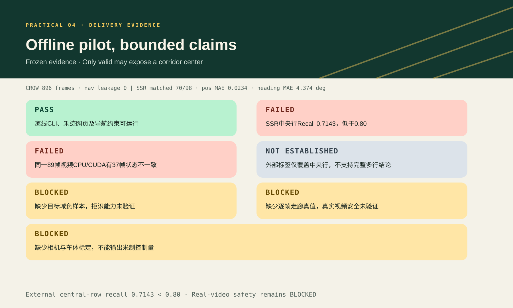

# Practical 04 导师简报：证据受限的离线作物行视觉 Pilot

日期：2026-09-11

## 一句话结论

本项目已完成一个可运行、可复现、带显式失效状态的离线作物行视觉Pilot；工程交付为 `PASS`，
SSR外部中央行Recall 0.7143为 `FAILED`，真实视频安全、目标域拒识和米制控制仍为 `BLOCKED`。

## 输入、处理与输出

- 输入：单目RGB田间视频或视频目录；
- 处理：颜色/形态学输入、多作物行检测、稳定ID、相邻走廊选择、Kalman与光流时序、严重遮挡守卫；
- 输出：全部活动作物行与ID、左右边界、图像中心/方向代理、置信度、状态、原因及逐帧记录；
- 接口：命令行与本地“禾迹”网页；
- 安全合同：只有 `valid` 可以携带走廊中心，其他三态只保留诊断信息。

## 核心证据

| 证据 | 结果 | 解释 |
|---|---:|---|
| 25段开发视频 | 10,995帧 | 用于时序开发、失败审计和严重遮挡守卫，不是独立外部测试 |
| 6段同源冻结视频 | 896帧，导航泄漏0 | 证明完整运行与状态合同；因无逐帧真值，安全准确率不可用 |
| SSR冻结外部中央行 | 70/98，Recall 0.7143 | 低于0.80门槛，属于有效外部负结果 |
| SSR匹配位置MAE | 0.0234 | 通过≤0.05门槛，只针对已匹配中央行 |
| SSR匹配方向MAE | 4.374° | 通过≤5°门槛，只针对已匹配中央行 |
| CPU/CUDA复现审计 | 同一89帧中37帧状态不同 | 精确一致性 `FAILED`；两端非valid导航泄漏均为0 |

## 方法演进

1. Day59～60先定义所有可见行、相邻边界和拒绝状态，并审计标签能力；
2. Day61～64建立全幅植被输入、多行几何和图像坐标走廊；
3. Day65～66通过稳定ID、光流、Kalman和状态机完成连续视频Pilot；
4. Day67用带纳入概率与设计权重的事件抽样识别严重遮挡；
5. Day68只对该原因增加一次受控守卫；
6. Day69冻结评估并交付CLI与“禾迹”；
7. Day70锁定哈希、指标、声明边界和可复现交付。

## 主要失败与限制

- 强阴影、残茬和稀疏幼苗会导致中央行漏检；
- SSR标签只支持中央行正样本评价，不能验证所有可见作物行；
- 没有目标域负样本，不能验证 `reject` 的开放集可靠性；
- 同源视频没有逐帧走廊有效性真值，不能计算真实false-valid率；
- 没有相机与车体标定，输出仍是图像坐标代理；
- 同一输入的CPU/CUDA状态轨迹有37帧不一致；正式复现实验须固定设备，当前演示计数以CPU为准；
- 尚未进行影子模式、实车闭环或安全认证。

## 推荐下一步

先建立目标域多行视频真值和负样本，按最高相关序列分组，再保留新的独立冻结测试；与此同时完成
相机内参、相机到车体外参和地面变换。验证顺序应为离线回放→影子模式→低速受控试验，而不是
把当前网页直接连接执行器。

实际界面和外部失败复核分别见：

- [禾迹本地视觉台截图](../../69_crop_row_frozen_evaluation/assets/heji_web_ui.png)
- [SSR外部失败复核图](../../69_crop_row_frozen_evaluation/assets/day69_v2_ssr_external_audit.jpg)
