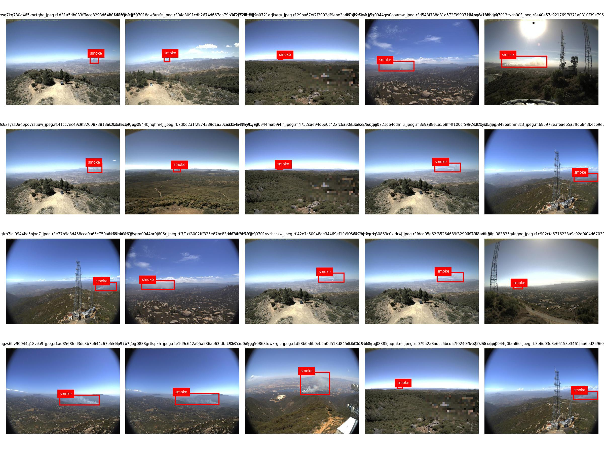
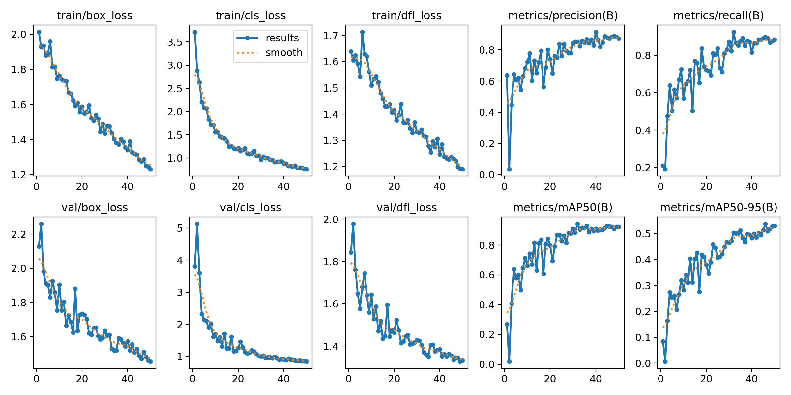
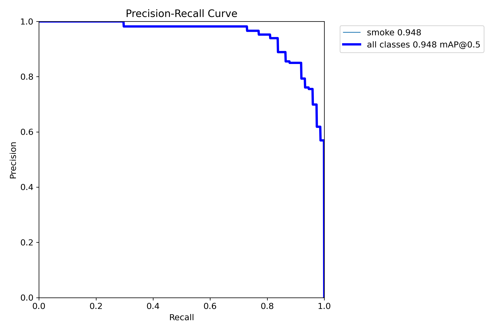
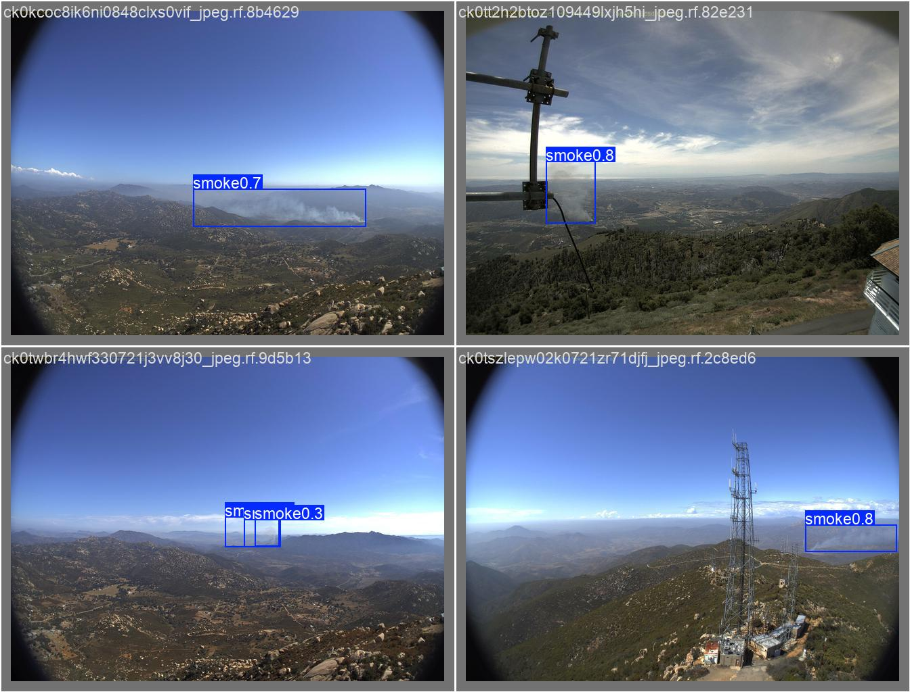
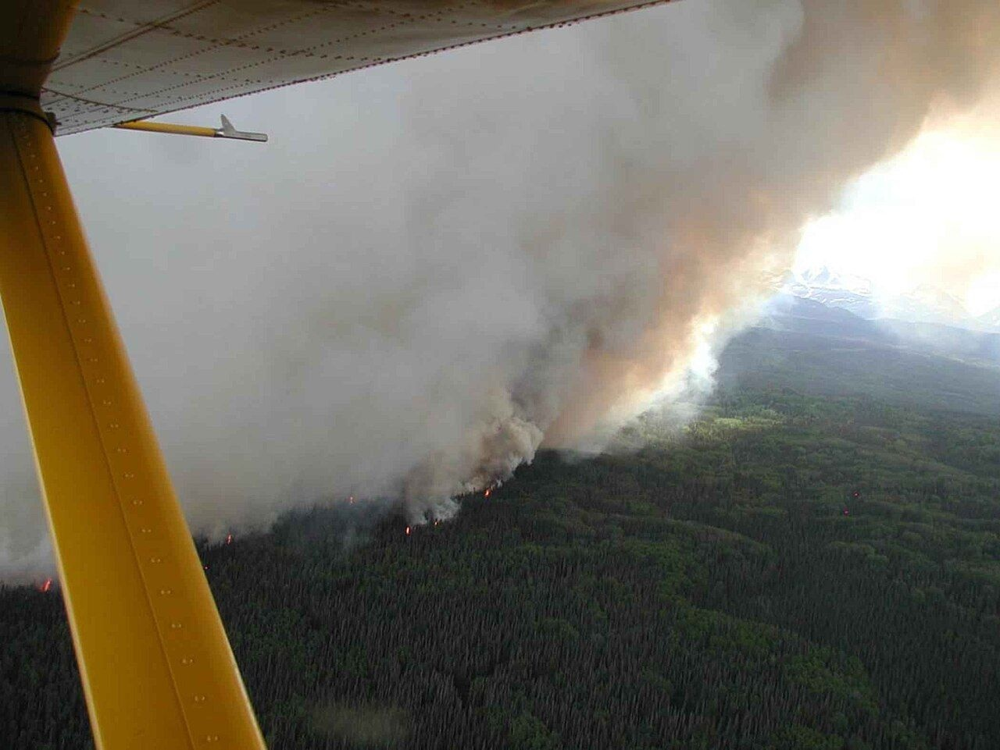

# YOLOv8 森林烟雾检测

基于 Ultralytics YOLOv8n 完成的单类别森林烟雾目标检测实战项目。

本项目的主要目标不是修改网络结构或追求更高的 mAP，而是完整实践目标检测项目流程：环境检查、预训练模型推理、冒烟训练、数据检查、标签可视化、自定义数据训练、测试集评估、外部图片推理以及错误分析。

## 项目流程

1. 检查 Python、PyTorch、CUDA、GPU 和 Ultralytics 环境。
2. 使用 YOLOv8n 预训练权重对官方示例图片进行推理。
3. 使用 COCO8 数据集进行 3 个 epoch 的冒烟训练。
4. 检查自定义数据集的类别、数量和图片标签配对关系。
5. 随机可视化 20 张训练图片及其真实框。
6. 使用预训练的 YOLOv8n 训练 50 个 epoch 的 baseline。
7. 在独立测试集上计算 Precision、Recall 和 mAP。
8. 使用训练集之外的烟雾图片及困难负样本测试模型泛化能力。

## 项目结构

```text
yolov8_wildfire_smoke_detection/
├── README.md
├── requirements.txt
├── .gitignore
├── assets/
│   ├── dataset_labels_preview.jpg
│   ├── training_results.png
│   ├── test_pr_curve.png
│   ├── test_predictions.jpg
│   └── external_smoke_missed.jpg
├── scripts/
│   ├── 01_check_environment.py
│   ├── 02_predict_pretrained.py
│   ├── 03_train_coco8.py
│   ├── 04_check_dataset.py
│   ├── 05_visualize_labels.py
│   ├── 06_train_custom.py
│   ├── 07_evaluate.py
│   └── 08_predict_custom.py
├── datasets/
│   └── wildfire_smoke/
│       ├── data.yaml
│       ├── train/
│       ├── valid/
│       └── test/
├── test_images/
│   ├── smoke/
│   ├── no_smoke/
│   └── SOURCES.md
├── outputs/
└── notes/
    └── experiment_log.md
```

数据集图片与标签、`outputs/` 和模型权重已通过 `.gitignore` 排除，不进入 Git 历史；用于说明目录和类别的 `data.yaml` 会保留，最佳权重通过 GitHub Release 单独发布。

## 运行环境

本项目已经在以下环境中运行验证：

- Windows
- Python 3.9.25
- PyTorch 2.5.1+cu121
- CUDA build 12.1
- NVIDIA GeForce RTX 3050 Laptop GPU（4 GB）
- Ultralytics 8.4.116
- NumPy 1.23.5
- OpenCV 4.11.0.86

安装项目依赖：

```bash
python -m pip install -r requirements.txt
```

GPU 训练所需的 PyTorch 应根据本机显卡和 CUDA 环境单独安装，因此没有固定在 `requirements.txt` 中。

## 数据集

项目使用 [Wildfire Smoke Object Detection Dataset](https://universe.roboflow.com/brad-dwyer/wildfire-smoke/dataset/1)，数据由 Roboflow 提供。

- 类别：`smoke`
- 训练集：516 张
- 验证集：147 张
- 测试集：74 张
- 许可：CC BY-NC-SA 4.0

数据集不随本仓库发布。下载后应以实际解压目录为准，并确认 `data.yaml` 中的路径能够正确指向图片目录。

## 运行顺序

在项目根目录依次运行：

```bash
python scripts/01_check_environment.py
python scripts/02_predict_pretrained.py
python scripts/03_train_coco8.py
python scripts/04_check_dataset.py
python scripts/05_visualize_labels.py
python scripts/06_train_custom.py
python scripts/07_evaluate.py
python scripts/08_predict_custom.py
```

首次运行时，Ultralytics 会下载所需的 YOLOv8n 预训练权重。训练生成的最佳权重位于：

```text
outputs/wildfire_train/weights/best.pt
```

### 下载已训练权重

- 文件：[project01-yolov8-wildfire-smoke-best.pt](https://github.com/59730w/opencv-learning/releases/download/model-weights-v1.0.0/project01-yolov8-wildfire-smoke-best.pt)
- 大小：6,236,835 字节（5.95 MiB）
- SHA-256：`0694D67026415C4B07E05158015BEB5FF6E5F07ABBAB23F27B4A11DD83AE3485`

下载后将文件保存为 `outputs/wildfire_train/weights/best.pt`，即可运行评估和自定义图片预测脚本。

## Baseline 设置

- 模型：YOLOv8n
- 预训练权重：`yolov8n.pt`
- 训练轮数：50
- 输入尺寸：640
- Batch size：4
- 随机种子：42
- 训练设备：GPU 0

## 实验结果

| 数据划分 | Precision | Recall | mAP50 | mAP50-95 |
| --- | ---: | ---: | ---: | ---: |
| 验证集 | 0.8750 | 0.8980 | 0.9240 | 0.5370 |
| 测试集 | 0.9271 | 0.8378 | 0.9485 | 0.5614 |

### 数据与训练结果

随机抽取 20 张训练图片进行标签可视化检查：



50 个 epoch 的训练曲线：



测试集 Precision-Recall 曲线：



测试集预测示例：



## 外部图片测试

使用置信度阈值 `0.25` 对训练集之外的真实图片进行推理：

| 图片类型 | 图片数量 | 检出图片 | 结果 |
| --- | ---: | ---: | --- |
| 烟雾图片 | 5 | 0 | 5 张全部漏检 |
| 无烟雾困难负样本 | 8 | 0 | 没有误检 |

外部烟雾图片的最高预测置信度约为 `0.058`，而一张雾天负样本达到约 `0.145`。因此，单纯降低置信度阈值不仅无法可靠解决漏检，还可能引入误检。

下面的图片中存在明显的森林火灾烟雾，但模型在阈值 `0.25` 下没有生成检测框：



外部测试图片包含烟雾、云、雾、蒸汽和扬尘场景，其来源及许可记录在 `test_images/SOURCES.md` 中。

## 结果分析

模型在原数据集的测试划分上取得了较高的 mAP，但在外部烟雾图片上没有成功检出目标。这说明当前结果主要证明了完整工程流程已经跑通，不能证明模型具备可靠的真实场景泛化能力。

可能原因包括：

- 原数据集规模较小，场景和烟雾外观相似度较高。
- 测试集与训练集可能具有较强的分布相似性。
- 数据集中缺少无目标背景图和云、雾、蒸汽等困难负样本。
- 外部图片中的烟雾尺度、颜色、背景和拍摄距离与训练数据不同。

## 后续改进方向

- 补充更多来源、天气、距离和烟雾形态的数据。
- 加入云、雾、蒸汽和扬尘等困难负样本。
- 按场景或数据来源划分训练集、验证集和测试集，减少相似图片泄漏。
- 完成数据改进后再进行参数对比，而不是只降低推理阈值。
- 保留当前外部测试集，作为后续模型的固定对照组。

## 项目定位

这是一个面向学习的 YOLOv8 目标检测工程实践，不是可直接用于森林火灾预警的生产系统。更完整的训练记录和错误分析参见 `notes/experiment_log.md`。
