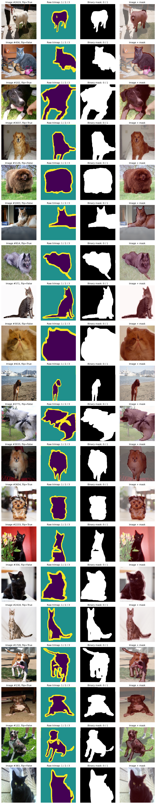
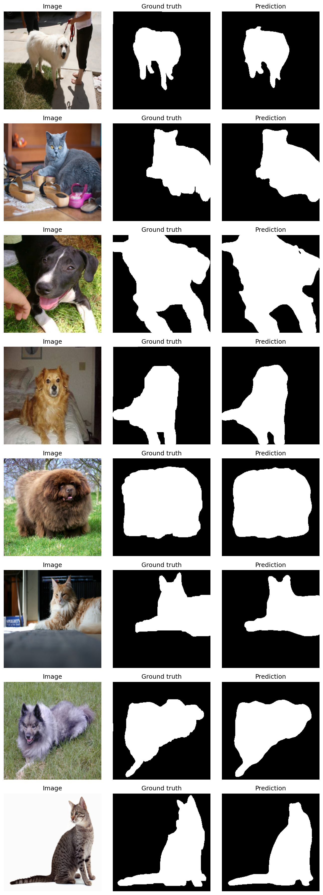
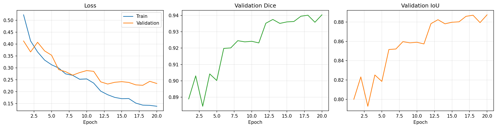
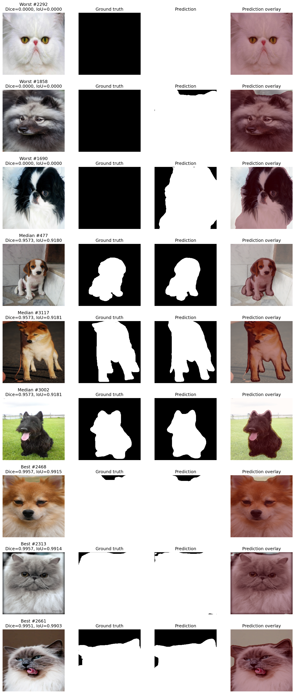
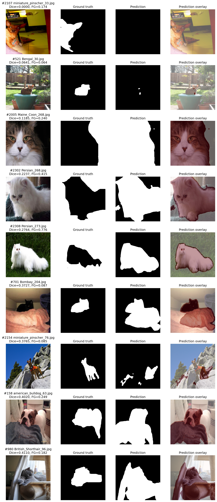
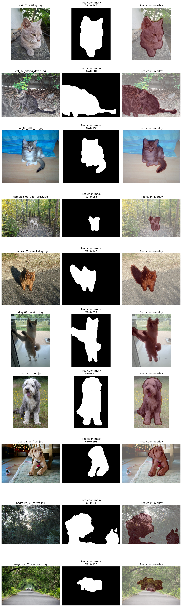

# U-Net Pet Segmentation

基于 PyTorch 和 `segmentation-models-pytorch` 实现的宠物前景二分类语义分割项目。

本项目使用 Oxford-IIIT Pet 数据集，完成了数据检查、同步预处理、冒烟测试、小数据集过拟合、完整训练、测试集评估、失败案例分析和外部图片测试。

## 项目目标

输入一张猫或狗的 RGB 图片，输出宠物前景的二值分割掩码：

- `0`：背景
- `1`：宠物及其边界

## 数据集

使用 [Oxford-IIIT Pet Dataset](https://www.robots.ox.ac.uk/~vgg/data/pets/)：

| 数据划分 | 数量 |
|---|---:|
| trainval | 3680 |
| test | 3669 |
| 总计 | 7349 |

原始 trimap 标签含义：

- `1`：宠物主体
- `2`：背景
- `3`：宠物边界

本项目转换为二分类标签：

```text
raw 1 或 raw 3 → 前景 1
raw 2          → 背景 0
```

数据检查结果：

```text
total pairs: 7349
name mismatches: 0
size mismatches: 0
mask values: [1, 2, 3]
```

训练时将 `trainval` 按固定随机种子划分为：

- 训练集：2944 张
- 验证集：736 张
- 随机种子：42

## 数据预处理

- 图像尺寸：`256 × 256`
- 图像插值：双线性插值
- 掩码插值：最近邻插值
- 图像归一化：ImageNet mean/std
- 数据增强：随机水平翻转
- 图像与掩码使用完全相同的几何变换

预处理后的张量形状：

```text
image: (3, 256, 256), float32
mask:  (1, 256, 256), float32
mask values: [0.0, 1.0]
```



## 模型与训练配置

模型使用 `segmentation-models-pytorch` 提供的 U-Net：

| 配置 | 参数 |
|---|---|
| 模型 | U-Net |
| 编码器 | ResNet18 |
| 编码器预训练 | ImageNet |
| 输入通道 | 3 |
| 输出通道 | 1 |
| 输入尺寸 | 256 × 256 |
| Batch size | 4 |
| Epoch | 20 |
| 优化器 | Adam |
| 初始学习率 | 1e-3 |
| 损失函数 | BCEWithLogitsLoss + Dice Loss |
| 学习率调度 | ReduceLROnPlateau |
| 混合精度 | PyTorch AMP |
| 阈值 | 0.5 |
| 随机种子 | 42 |

训练环境：

```text
Python 3.9.25
PyTorch 2.5.1+cu121
torchvision 0.20.1+cu121
segmentation-models-pytorch 0.5.0
GPU: NVIDIA GeForce RTX 3050 Laptop GPU
```

## 流程验证

在完整训练前进行了两项检查。

### 冒烟测试

验证了以下完整链路：

```text
Dataset
→ DataLoader
→ U-Net forward
→ loss
→ backward
→ optimizer.step
```

运行结果：

```text
smoke test: PASSED
parameter changed: True
```

### 小数据集过拟合

使用固定的 8 张图片进行过拟合测试：

```text
final loss: 0.1031
final dice: 0.9676
final iou: 0.9373
tiny overfit test: PASSED
```

该结果说明数据、标签、损失函数和反向传播链路能够正常工作。



## 训练结果

20 个 epoch 后的最佳验证结果：

```text
best validation Dice: 0.9404
validation IoU:        0.8874
```



## 测试集评估

在 Oxford-IIIT Pet 官方 test 集的 3669 张图片上评估：

| 指标 | 结果 |
|---|---:|
| Global Dice | 0.9434 |
| Global IoU | 0.8928 |
| Mean per-image Dice | 0.9362 |
| Median per-image Dice | 0.9573 |
| Maximum per-image Dice | 0.9957 |



## 失败案例分析

测试集中发现 7 张全背景掩码异常样本。这些样本会得到接近零的 Dice，但不能直接视为普通模型失败，因此单独进行了数据审计。

排除全背景异常标注后，较差样本主要包含：

- 宠物在图片中占比很小
- 背景复杂
- 宠物与背景颜色接近
- 图片存在裁剪或标注不完整
- 测试目标与训练集常见构图差异较大



## 外部图片测试

另外使用了 10 张不属于 Oxford-IIIT Pet 数据集的图片：

- 3 张猫
- 3 张狗
- 2 张小目标或复杂背景宠物
- 2 张没有猫狗的负样本

猫狗图片基本能够定位宠物区域，小目标和复杂背景图片也能产生合理结果。

但是，两张负样本均出现误检：

```text
forest foreground ratio: 0.3392
car road foreground ratio: 0.1128
```



这说明模型虽然在同分布测试集上取得了较高 Dice 和 IoU，但对训练分布之外的场景仍然可能产生明显误检。

外部图片的作者、来源和许可证记录在：

```text
external_images/SOURCES.md
external_images/sources.json
```

## 项目结构

```text
unet_pet_segmentation/
├── assets/                    # 训练曲线和预测可视化
├── datasets/                  # Oxford-IIIT Pet 数据集，不上传 GitHub
├── external_images/           # 外部测试图片及来源说明
├── outputs/                   # 模型、指标和实验输出
├── scripts/
│   ├── inspect_preprocessing.py
│   ├── smoke_test.py
│   ├── tiny_overfit.py
│   ├── train_baseline.py
│   ├── evaluate_test.py
│   ├── audit_test_failures.py
│   └── predict_external.py
├── src/
│   └── pet_dataset.py
├── README.md
└── requirements.txt
```

## 运行方式

以下命令均在项目根目录执行。

### 1. 检查预处理结果

```bash
python scripts/inspect_preprocessing.py
```

### 2. 运行冒烟测试

```bash
python scripts/smoke_test.py
```

### 3. 小数据集过拟合测试

```bash
python scripts/tiny_overfit.py
```

### 4. 训练基线模型

```bash
python scripts/train_baseline.py
```

训练得到的最佳模型保存在：

```text
outputs/baseline/best_model.pth
```

### 5. 测试集评估

```bash
python scripts/evaluate_test.py
```

### 6. 失败案例审计

```bash
python scripts/audit_test_failures.py
```

### 7. 外部图片推理

将待测试的 `.jpg`、`.jpeg` 或 `.png` 图片放入：

```text
external_images/
```

然后运行：

```bash
python scripts/predict_external.py
```

输出保存在：

```text
assets/external_predictions.png
```

## 已知局限

- 训练数据仅来自 Oxford-IIIT Pet，数据分布比较单一。
- 模型只学习宠物前景分割，没有学习“图片中不存在宠物”这一独立任务。
- 对森林、道路等域外负样本可能产生误检。
- 所有训练和评估图片统一缩放到 `256 × 256`，可能损失细小边界信息。
- 目前只使用随机水平翻转，数据增强方式较少。
- Oxford-IIIT Pet 测试集中存在少量异常或近乎无效的分割标注。
- 当前结果是学习型基线，不适合直接用于实际生产环境。

## 后续改进方向

- 加入无猫狗负样本和复杂背景图片重新训练。
- 使用随机裁剪、颜色扰动和尺度变化等数据增强。
- 尝试 Focal Loss、Tversky Loss 等损失函数。
- 对比不同编码器和输入分辨率。
- 增加连通域过滤等后处理方法。
- 使用来源独立的外部数据集评估真实泛化能力。