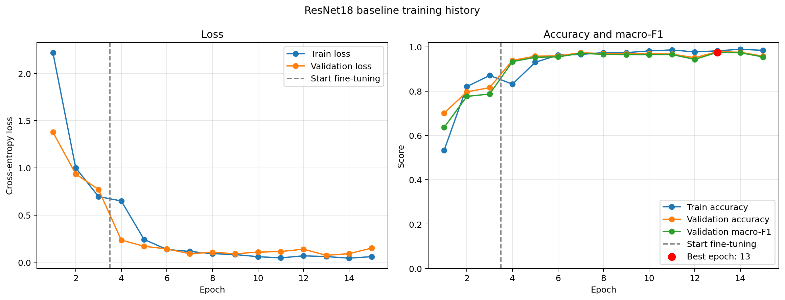
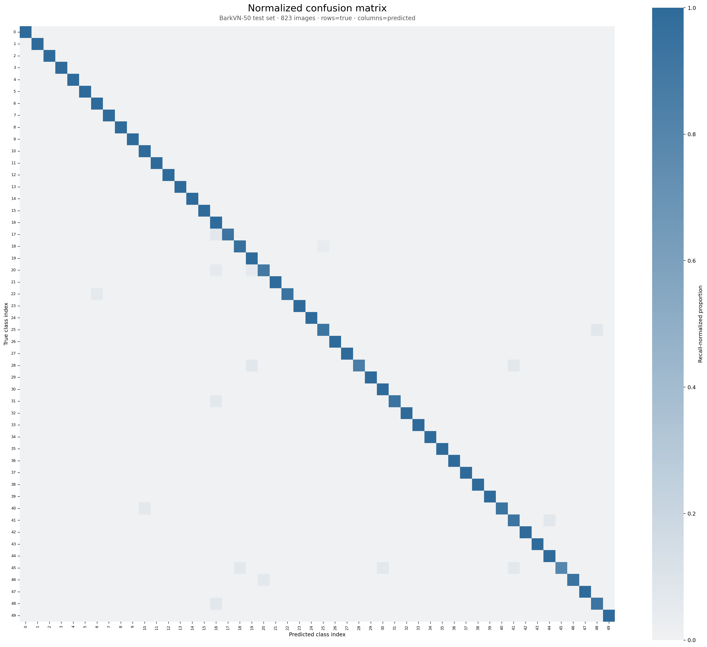
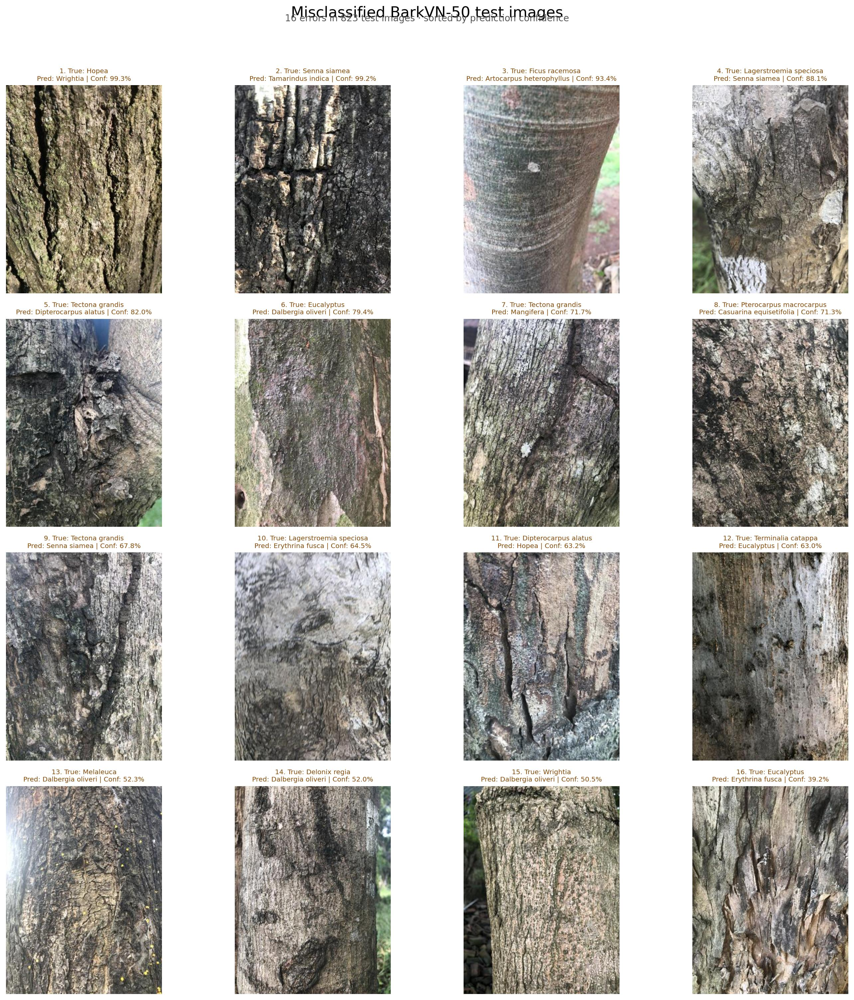
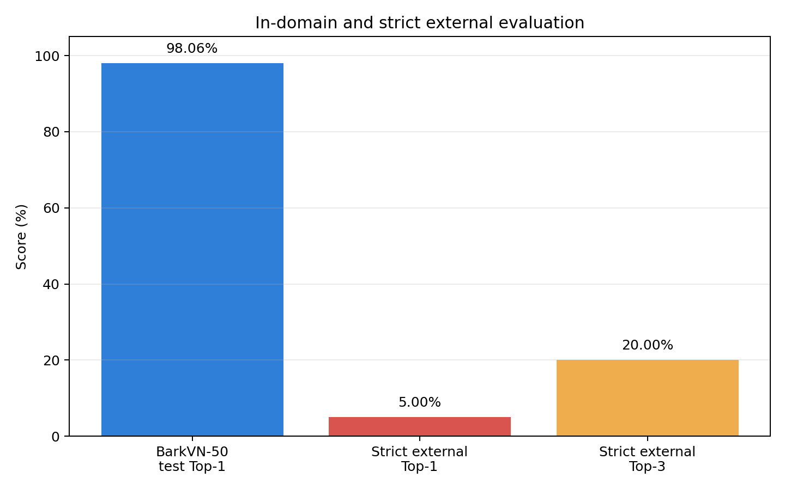

# Project 03｜BarkVN-50 树皮树种分类

基于 OpenCV 数据审计、BarkVN-50 和 ImageNet 预训练 ResNet18 的 50 类树皮分类机器视觉项目。项目覆盖数据质量检查、重复与相似图片分组、迁移学习、正式测试、错误分析、外部分布测试、单图推理和 Gradio Demo。

> **结论先行：**模型在 BarkVN-50 同来源测试集上达到 98.06% Accuracy 和 0.9790 Macro-F1，但严格外部正样本 Top-1 仅为 5.00%。因此本项目是受控近距离树皮分类的学习与研究基线，不是可直接部署的野外整树识别系统。

## 主要成果

- 原始数据：5,578 张图片、50 个类别。
- 排除 20 张跨类别完全重复冲突图片，最终使用 5,558 张。
- 使用感知哈希建立 5,189 个相似组，检测到的相似组不跨数据子集。
- 分组划分：训练 3,891 张、验证 844 张、测试 823 张。
- 最佳模型：ImageNet 预训练 ResNet18，第 13 轮检查点。
- 同来源测试：807/823 预测正确，Accuracy 98.06%，Macro-F1 0.9790。
- 严格外部测试：Top-1 1/20（5.00%），Top-3 4/20（20.00%）。
- 6 张负样本均被闭集分类器强制归入某个树种，证明模型不具备未知类别拒绝能力。
- 提供命令行 Top-3 推理和本地 Gradio Demo。

## 结果展示

### 训练过程



### 归一化混淆矩阵



### 测试集误分类案例



### 同来源与外部分布差距



## 项目结构

```text
03_forest_species_classification/
├── app.py                  # Gradio 单图 Demo
├── assets/                 # README 使用的精选成果图
├── configs/                # ResNet18 训练配置
├── datasets/processed/     # 类别映射、排除清单、相似组和划分清单
├── docs/                   # 数据、训练、评估和外部测试说明
├── external_images/        # 外部测试来源与许可清单，不含图片本体
├── results/                # 精选小型指标、CSV 与报告
├── scripts/                # 审计、训练、评估、预测和验收入口
├── src/                    # 数据、模型、训练、推理和可视化核心代码
└── tests/                  # 自动化测试
```

原始数据集、完整运行输出、外部测试原图和模型权重不纳入 Git 仓库。

## 环境

已验证环境：

- Python 3.9.25
- PyTorch 2.5.1+cu121
- torchvision 0.20.1+cu121
- OpenCV 4.10.0
- Gradio 4.44.1
- Pydantic 2.10.6
- NVIDIA GeForce RTX 3050 Laptop GPU（4 GB）

安装依赖：

```bash
python -m pip install -r requirements.txt
python -m pip check
```

`pydantic==2.10.6` 是 Gradio 4.44.1 / gradio-client 1.3.0 的兼容性锁定，避免新版 JSON Schema 中布尔型 `additionalProperties` 导致 Demo 启动失败。

## 数据集准备

数据集：BarkVN-50 Version 1，CC BY 4.0。

- 官方页面：https://data.mendeley.com/datasets/gbt4tdmttn/1
- DOI：https://doi.org/10.17632/gbt4tdmttn.1

下载并解压后，保持以下目录结构：

```text
datasets/raw/BarkVN-50/v1/images/BarkVN-50_mendeley/
├── Acacia/
├── Adenanthera microsperma/
└── ... 共 50 个类别
```

详细下载记录、哈希和数据限制见 [docs/data_source.md](docs/data_source.md)。

## 复现实验

建议按以下顺序执行：

```bash
python scripts/audit_dataset.py
python scripts/check_exact_duplicates.py
python scripts/compute_perceptual_hashes.py
python scripts/find_near_duplicates.py
python scripts/build_similarity_groups.py
python scripts/make_grouped_split.py
python scripts/validate_data_pipeline.py
python scripts/smoke_test_training.py
python scripts/overfit_tiny_batch.py
python scripts/preflight_training.py
python scripts/train_baseline.py
python scripts/evaluate_test.py
python scripts/build_classification_report.py
python scripts/plot_confusion_matrix.py
python scripts/visualize_misclassified_images.py
```

完整检查点会生成到：

```text
checkpoints/resnet18_baseline/best.pt
```

模型权重未上传；运行单图推理或 Gradio Demo 前，需要先完成训练，或自行把兼容检查点放到上述位置。

## 外部测试

外部图片来自 Wikimedia Commons。作者、来源页面、直接下载地址和许可记录在 [external_images/metadata.csv](external_images/metadata.csv)。图片本体不上传，可重新下载：

```bash
python scripts/download_external_images.py
python scripts/evaluate_external_images.py
python scripts/build_external_evaluation_report.py
python scripts/verify_day6_external_test.py
```

冻结的严格结果与 post-hoc 五裁剪探索分开保存，五裁剪结果不能覆盖原始 5.00% Top-1 结论。

## 单图推理

```bash
python scripts/predict_single_image.py --image "path/to/bark.jpg"
```

程序输出 Top-3 类别和概率。概率只是 50 个已知类别之间的相对分数，不代表输入一定属于这些类别。

## Gradio Demo

```bash
python app.py
```

浏览器默认打开 `http://127.0.0.1:7860`。模型在首次预测时延迟加载，界面会始终展示外部泛化限制。

## 测试

```bash
python -m pytest -q
```

不含 BarkVN-50 数据时，依赖原始图片的数据集测试会自动跳过；推理工具、外部分析、可视化和 Gradio 结构测试仍会运行。

## 关键限制

1. BarkVN-50 没有树木个体、地点或采集批次 ID，无法按真实个体或来源隔离划分。
2. 感知哈希分组减少了近重复泄漏，但连续文件编号仍大量跨子集，内部指标可能偏乐观。
3. 训练图主要是树皮占满画面的近景，不能自然泛化到宽视角树干或复杂背景。
4. 模型是 50 类闭集分类器，不会拒绝非树皮图片或未知树种。
5. 外部样本规模较小，只用于诊断域偏移，不代表总体性能。

详细证据见 [外部评估报告](results/external_test/external_evaluation_report.md) 和 [测试错误分析](docs/test_error_analysis.md)。

## 数据引用

Truong Hoang, Vinh (2020), “BarkVN-50”, Mendeley Data, Version 1. DOI: 10.17632/gbt4tdmttn.1。
