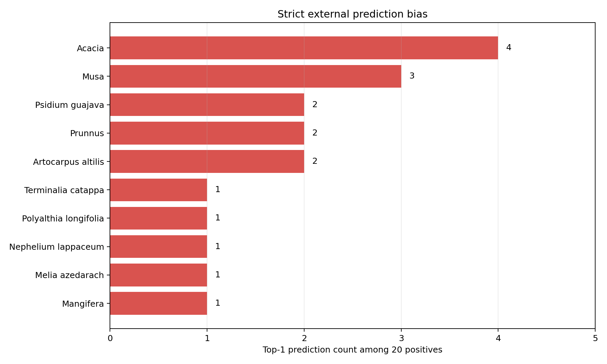

# BarkVN-50 ResNet18 外部评估与根因分析

> 生成日期：2026-08-14。严格外部测试集已固定；本报告不使用外部图片训练、选检查点或调参。

## 结论

当前模型完成了可复现的50类树皮分类工程流程，在BarkVN-50同来源测试集上表现很高，
但无法可靠泛化到不同国家、设备、光照、树龄和拍摄距离的开放网络图片。
它适合作为学习与受控近距离树皮分类基线，不适合作为野外整树识别系统直接部署。

## 严格外部测试

| 指标 | 正确数 | 结果 |
| --- | ---: | ---: |
| Top-1 | 1/20 | 5.00% |
| Top-3 | 4/20 | 20.00% |

严格结果使用第13轮最佳检查点、`Resize(256) + CenterCrop(224)`和ImageNet归一化。
20张正样本与6张负样本均在推理前固定，看到结果后没有换图。

## 同来源测试与外部测试的落差

| 数据 | 图片数 | Accuracy / Top-1 | Macro-F1 |
| --- | ---: | ---: | ---: |
| BarkVN-50官方测试 | 823 | 98.06% | 0.9790 |
| 严格外部正样本 | 20 | 5.00% | 不适用 |

该落差说明内部高分主要代表与BarkVN-50采集条件相似时的识别能力，不能外推为任意场景树种识别能力。

## 视角表现

| 视角 | 图片数 | Top-1 | Top-3 |
| --- | ---: | ---: | ---: |
| closeup | 10 | 1/10 (10.00%) | 2/10 (20.00%) |
| wider_trunk | 10 | 0/10 (0.00%) | 2/10 (20.00%) |

较宽树干包含天空、树叶、地面和建筑等背景，而训练集主要是树皮占满画面的局部照片。
近景仍然很低，说明拍摄尺度不是唯一根因，跨来源纹理与颜色差异同样重要。

## 逐类别严格结果

| 类别 | 图片数 | Top-1 | Top-3 |
| --- | ---: | ---: | ---: |
| Anacardium occidentale | 2 | 0 | 1 |
| Artocarpus heterophyllus | 2 | 0 | 0 |
| Carica papaya | 2 | 0 | 0 |
| Cocos nucifera | 2 | 0 | 0 |
| Delonix regia | 2 | 0 | 0 |
| Hevea brasiliensis | 2 | 0 | 0 |
| Psidium guajava | 2 | 1 | 2 |
| Tamarindus indica | 2 | 0 | 0 |
| Tectona grandis | 2 | 0 | 0 |
| Terminalia catappa | 2 | 0 | 1 |

## 预测偏向

| 被预测类别 | 次数 |
| --- | ---: |
| Acacia | 4 |
| Musa | 3 |
| Artocarpus altilis | 2 |
| Prunnus | 2 |
| Psidium guajava | 2 |
| Artocarpus heterophyllus | 1 |
| Eucalyptus | 1 |
| Mangifera | 1 |
| Melia azedarach | 1 |
| Nephelium lappaceum | 1 |
| Polyalthia longifolia | 1 |
| Terminalia catappa | 1 |

## 负样本

这是闭集50类分类器，因此森林、叶片、花、果实、岩石和木板仍会被强制归入某个树种。
6张负样本平均Top-1置信度为54.71%，
最高为70.21%；置信度不低于80%的数量为0。
这不能被解释成模型具备未知类别拒绝能力。

## 数据划分风险证据

按同类别文件编号排序后，发现 **2,442 对**编号差不超过2、却落入不同子集的相邻图片，涉及 **50 个类别**。
例如连续编号照片可能分别进入train、validation和test。

该统计是采集序列泄漏的风险指标，不等价于已经证明每一对图片来自同一棵树；
但结合连续文件名和高度相似的拍摄构图，它足以说明当前划分没有实现按树木个体、地点或采集来源隔离。
感知哈希分组减少了近重复泄漏，却不能替代可靠的个体/来源元数据。

## 五裁剪探索实验（post-hoc）

| 指标 | 中心裁剪严格基线 | 五裁剪探索 |
| --- | ---: | ---: |
| Top-1 | 1/20 (5.00%) | 2/20 (10.00%) |
| Top-3 | 4/20 (20.00%) | 3/20 (15.00%) |

五裁剪是在看到严格外部基线后设计的，因此 **不是新的严格外部测试**，不能覆盖5%的原始结论。
Top-1略升但Top-3下降，证明裁剪只能解释少量尺度问题，无法修复训练数据来源单一。

## 根因判断

1. **有直接证据：** 训练图主要是近距离树皮，外部图构图和背景差异明显。
2. **有直接证据：** 连续编号图片大量跨子集，内部测试并非来源独立评估。
3. **合理推断：** 不同地点、设备、树龄、湿度、苔藓和光照造成明显域偏移。
4. **任务边界：** 仅凭树皮近景训练的闭集分类器不能自然获得整树识别和未知类别拒绝能力。

## 下一轮有效改进

- 收集多地点、多设备、多树木个体和多树龄的独立训练图片。
- 同时覆盖树皮近景、较宽树干和真实复杂背景，并记录树木个体、地点和来源ID。
- 按树木个体或采集来源划分train/validation/test，而不是只依赖图片相似度。
- 保留当前26张图片为冻结证据；下一轮模型应建立新的独立外部测试集。
- 若产品需要拒绝非树皮图片，应单独训练树皮/非树皮门控模型或开放集识别模块。

## 阶段评价

实战三已经成功完成了数据审计、泄漏风险分析、迁移学习、内部评估、错误分析和外部测试闭环。
当前成果是可靠的学习与研究基线，但尚不是可部署的野外树种识别系统。
保留失败结果和适用边界，是本项目最重要的工程结论之一。
